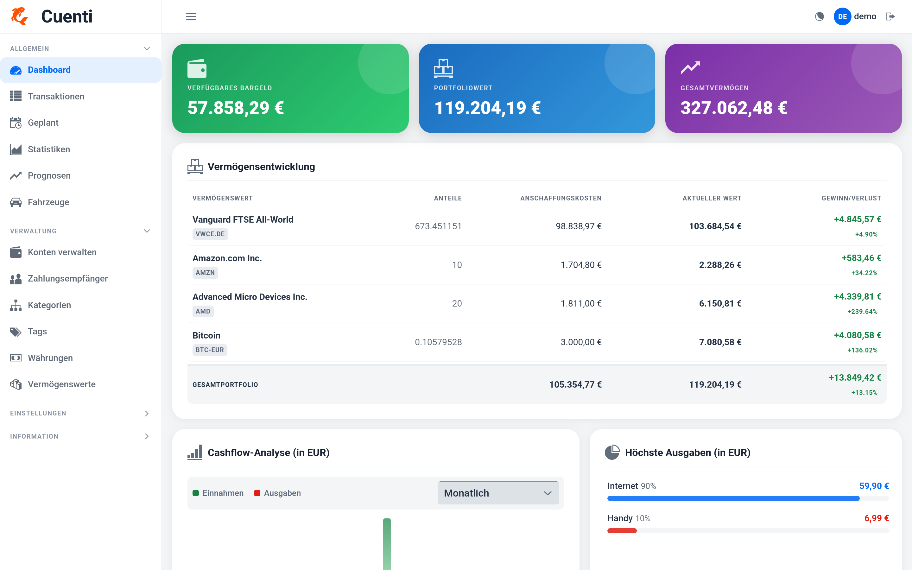

#  Cuenti Housekeeping Book 

A comprehensive personal finance management application that helps you track your income, expenses, assets, and investments all in one place.

<p align="center">
  
</p>

## Highlights

- Secure user authentication and authorization
- Account management with balances and transaction history
- Money transfers with validation
- Clean, maintainable project structure
- Modern web UI

## Tech Stack

Java 17 · Spring Boot · Spring Security · PostgreSQL · Vaadin · Maven

## Production Ready (Docker)

Before running in production, generate a secure JWT secret key:

```bash
echo "JWT_SECRET=$(openssl rand -base64 48)" >> .env
```

Then start the application:

```bash
./scripts/start.sh
```

## Development Mode

```bash
user: demo
pass: demo123
```

### Run Locally (H2 DB)

```bash
./scripts/start-test.sh
```

Available at **http://localhost:8080**
