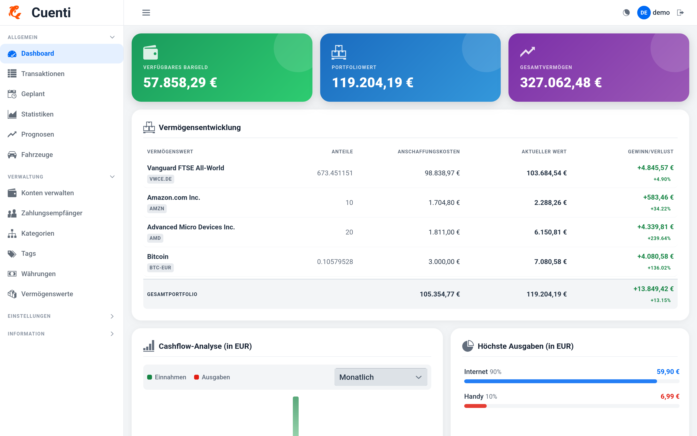

#  Cuenti

A self-hosted personal finance manager: accounts, transactions, budgets, scheduled
payments, investments and reports in one place.

<p align="center">
  
</p>

## Features

**Money**
- Accounts (checking, savings, cash, …) with running balances and multi-currency support
- Transactions: income, expense, transfer — with splits, payees, categories, tags and notes
- Scheduled transactions with recurrence, due/overdue badge, post or skip (single or bulk)
- Budgets per category with progress tracking
- Saved views: reusable transaction filters

**Insight**
- Dashboard with balances and current position
- Statistics: spending by category, payee, tag, over time
- Forecasts: per-month income/expense projection for a calendar year, built from schedules
- Vehicle/fuel report: consumption and cost per km from expense memos
  (`d=45210` odometer km, `l=41.3` liters, `full` marks a full tank)

**Assets & currencies**
- Stocks, ETFs and crypto with price refresh from Yahoo Finance
- Custom currencies incl. BTC with 8-decimal precision, exchange-rate conversion

**Data**
- HomeBank `.xhb` import and export
- Trade Republic `.csv` import
- Full JSON export/import of a profile

**Admin & platform**
- JWT-authenticated REST API under `/api/*` covering every domain area
- User registration, roles (`ROLE_ADMIN`), admin user management and profile cleanup
- Login rate limiting (10 attempts per IP per window)
- Audit log of security- and money-relevant actions (admin only)
- English and German UI, light/dark theme
- Actuator health endpoint at `/actuator/health`

## Tech Stack

Java 25 · Spring Boot 4.1 · Spring Security (JWT) · Vaadin 25 · PostgreSQL 18 · Flyway · Maven

## Run in Production (Docker)

Generate a secure JWT secret first:

```bash
echo "JWT_SECRET=$(openssl rand -base64 48)" >> .env
```

Then start app + PostgreSQL:

```bash
./scripts/start.sh
```

Uses `docker-compose.prod.yml`, profile `production`, Flyway migrations, no demo users.
Optional `.env` overrides: `DB_NAME`, `DB_USERNAME`, `DB_PASSWORD`.

## Development

### Local, H2 in-memory DB

```bash
./scripts/start-test.sh
```

Requires Maven and Java 17, 21 or 25 on the PATH. Note the project itself targets Java 25.

### Local, PostgreSQL in Docker

```bash
./scripts/start-docker-test.sh
```

Available at **http://localhost:8080**

Demo credentials (non-production profiles only):

```
user: demo
pass: demo123
```

### Tests

```bash
./mvnw test
```

## Project Layout

```
src/main/java/com/cuenti/app/
  api/         REST controllers + DTOs
  config/      async, i18n, error handling, password encoder
  model/       JPA entities
  repository/  Spring Data repositories
  security/    JWT filter, Vaadin security config
  service/     business logic (transactions, assets, import/export, forecasts, …)
  views/       Vaadin UI
src/main/resources/
  db/          Flyway migrations
  messages*.properties   English/German translations
```
